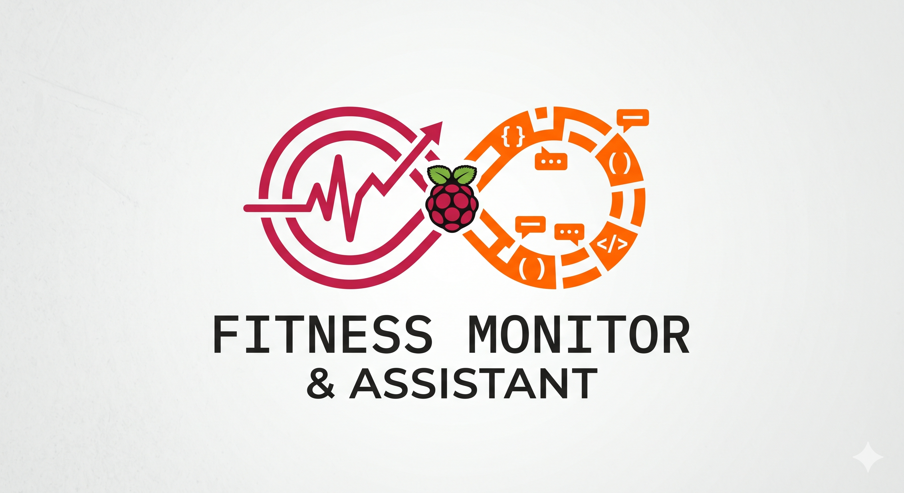

# Fitness Monitor & Assistant

<p align="center">
  
</p>

A self-hosted Raspberry Pi 5 platform that turns your Garmin watch + Open Food Facts into a single SQLite store and exposes it through three surfaces: a Telegram chat assistant powered by Claude, a high-contrast FastAPI dashboard, and a daily Telegram digest. Everything runs on your Pi. The only third party between you and your data is `python-garminconnect`.

## What you can do

**Talk to it.** The Telegram bot is a chat-first agent. Plain text, photos, and barcodes all flow through Claude with twelve tools (read your meals, summary, trends, activities, readiness, training intel; propose insert/edit/delete; OFF barcode lookup). Every write is gated by a Confirm/Cancel inline keyboard.

```
You: chicken stir-fry with rice, ~620 kcal
Bot: 📝 preparing meal log… → "Logged: chicken stir-fry — 620 kcal · 35g P / 70g C / 18g F"
     [✅ Log it]  [❌ Cancel]

You: how's my protein this week?
Bot: 🍽️ scanning recent meals… → "You're averaging 95g/day — 78% of your 125g target.
     Wednesday was lowest (52g). Add a protein source to lunch."

You: should I train hard today?
Bot: ✨ computing readiness… → 💪 crunching training metrics…
     "Score 72 (medium). HRV +6%, RHR +1%, sleep was light. Moderate session."
```

**Watch it.** The FastAPI dashboard renders the same data with neon-on-ink cards: a hero readiness ring, training-intel widgets (ACWR injury risk, Foster monotony, weekly Z2 minutes, sleep debt), a year heatmap, macro progress rings, an Energy Availability indicator with the IOC RED-S threshold, and a 7-day calorie balance chart. Every tile has an info button that slides in a panel with definitions, a data-driven insight, and source citations (Plews, Buchheit, Gabbett, Foster, Seiler, IOC RED-S, etc.).

**Get nudged.** A daily 08:00 Telegram digest summarises yesterday's metrics. Smart alerts trigger on RHR-trend climbs, HRV drops vs baseline, illness risk (RHR↑ + HRV↓ for 2+ days), and training-window readiness — thresholds calibrated against the cited literature.

## Quick start (Raspberry Pi 5, Pi OS Bookworm)

```bash
git clone https://github.com/fdsimoes-git/garmin-monitor.git
cd garmin-monitor
bash scripts/setup.sh                          # apt + venv + base deps

# Optional extras
.venv/bin/pip install -r requirements-web.txt  # FastAPI dashboard
.venv/bin/pip install -r requirements-bot.txt  # Anthropic SDK for the bot

cp .env.example .env
# edit .env: Garmin creds, Telegram bot token + chat id, biometrics, Claude credential

.venv/bin/python -m src.cli init-db
.venv/bin/python auth_setup.py                 # cache Garmin tokens once (handles MFA)
.venv/bin/python -m src.cli poll               # first poll
```

## Telegram bot setup

1. DM [@BotFather](https://t.me/BotFather) → `/newbot` → save the token
2. DM your new bot anything (so it has permission to reply to you)
3. Open `https://api.telegram.org/bot<TOKEN>/getUpdates` and copy your `chat.id`
4. Set `TELEGRAM_BOT_TOKEN` and `TELEGRAM_CHAT_ID` in `.env`

For the chat assistant (optional), set ONE of these in `.env`:

- `CLAUDE_CODE_OAUTH_TOKEN` (recommended) — generated by `claude setup-token`; bills calls to your Claude Code subscription
- `ANTHROPIC_API_KEY` — pay-as-you-go API key

Default model is `claude-sonnet-4-6`; override via `CLAUDE_MODEL`.

What you can say to the bot:

| Input | What happens |
|---|---|
| Plain text describing a meal | Claude proposes a `log_meal` with macros → Confirm/Cancel keyboard |
| A photo of food | Visual estimate of the plate → Confirm/Cancel |
| A photo of a packaged product | Claude reads the barcode → Open Food Facts lookup → Confirm/Cancel |
| A bare 8–14 digit barcode | Direct OFF lookup → Confirm/Cancel (no Claude call) |
| `delete the snack from yesterday` | Looks up the meal, proposes `delete_meal` → Confirm |
| `change meal 12 to 250 kcal` | Proposes `edit_meal` → Confirm |
| `how's my protein this week?` | Aggregates recent meals → text reply |
| `should I train hard today?` | Calls readiness + training-intel tools → recommendation |

Photo bytes are passed to Claude in-memory and **discarded** — nothing is written to disk or SQLite. Every write requires explicit confirmation. The model never sees `raw_json` columns or internal fields.

## Run as a service (auto-start on boot)

```bash
sudo cp systemd/*.service systemd/*.timer /etc/systemd/system/
sudo systemctl daemon-reload
sudo systemctl enable --now garmin-poller.timer    # poll every 15 min
sudo systemctl enable --now garmin-digest.timer    # daily 08:00 Telegram digest
sudo systemctl enable --now garmin-prune.timer     # weekly cleanup
sudo systemctl enable --now garmin-bot.service     # Telegram chat assistant (optional)
```

If your install isn't under `/home/pi/`, edit `WorkingDirectory`, `EnvironmentFile`, `ExecStart`, and `User` in each unit file before copying.

The FastAPI dashboard isn't a systemd unit by default — start it manually with `python -m src.cli dashboard --host 0.0.0.0 --port 8080` or wrap it in your own unit if you want it always-on.

## Architecture

```
                                  Garmin Connect
                                        │ HTTPS, every 15 min
                                        ▼
                            ┌──────────────────────┐
                            │  garmin_poller.py    │ ── smart_alerts.py ──► Telegram
                            └──────────┬───────────┘
                                       │
                                       ▼
   Open Food Facts ── food.py ──►  ┌────────┐  ◄── insert/edit/delete (Confirm/Cancel)
                                   │ db.py  │
   Telegram inbound ── bot ───────►│ SQLite │
                       │           └────┬───┘
                       │                │
                       ▼                ▼
                  llm.py (Claude)   dashboard.py ── browser
                  ↑       ↑
                  │       └─ chat agent: 12 tools (8 read + 3 write + 1 OFF)
                  └─ vision: Claude reads photos in-memory (never persisted)
```

## Storage & retention

- `activities` and `meals` pruned after 90 days; `daily_summary` and `alerts` kept forever (one row per day, negligible size).
- Weekly Sunday-03:00 prune timer runs `prune_old_data` + `VACUUM`. Adjust window: `python -m src.cli prune --days 60`.
- All event timestamps stored as UTC ISO; day-bucketing follows Pi-local time via `db.local_today()`. See [CLAUDE.md](./CLAUDE.md) for the full convention.

## Privacy & safety guarantees

- **No raw input persistence** — image bytes are stack-only for the duration of one Claude call, then discarded.
- **No auto-writes** — every meal insert / edit / delete requires explicit Confirm.
- **Field whitelisting** — `log_meal` and `edit_meal` filter input against the documented schema; spurious keys silently dropped.
- **Token discipline** — read tools project results to allowlists, dropping `raw_json` (can be tens of KB per row from OFF or Garmin) before the model sees them.
- **Local data, local network** — the dashboard binds to your LAN by default; the bot whitelists a single Telegram chat ID.

## Tests

```bash
.venv/bin/pytest -q
```

170 tests, ~1.5s. The base install runs the suite without bot extras (`tests/test_llm.py` is skipped via `pytest.importorskip` if `anthropic` isn't installed).

## License

[](LICENSE)

## Internals

[CLAUDE.md](./CLAUDE.md) is the source of truth on conventions, the bot's tool surface, the validate-and-stash pattern, gotchas (Anthropic OAuth + Claude Code system prefix, MFA on first Garmin login, time-zone split between UTC storage and local bucketing), and the smart-alert literature citations.
